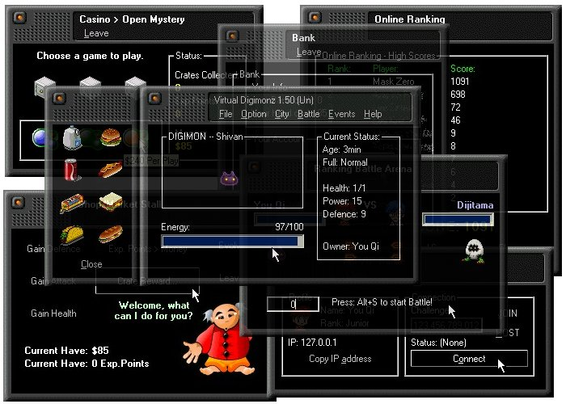



## VirtualDigimonz1\.75 \-The VirtualPet That U Adopt And Fight\.\.\.\.\(The Best Game Ever In PSC\!\! REALLY\!\!\!

### Description

VIRTUAL DIGIMONZ OFFICIALL SITE: http://VirtualDigimonz.onweb.cx

 

Sorry For The 1.85 that I realease EXE file in PSC. The code have been deleted by me. But I just only need yours comments only. Never mine, I just release my 1.75 source code first, ok?

This is my Best Game Project since I learn VB 4 years ago. I'm 16. This project are already over 1 year(January 2001 until now) of making . I never since before adopt pet games in computer that greatest than this! Just like Digimon that you play, u can fight with your friends digimon. In this game, it through TCP/IP to connect and fight or you can fight with computer! There are many many many many game ideas that I think out, like: Online Ranking(You will get scores in the battle), Professional hire(Hire a Professional(Robber, Theif, ...) and throught TCP/IP to steal information from your friend digimon or steal his money), Online Transfer Money(Like Cheque), Games like... Lottery, Casino(to earn credit[credit is use for gainning ur pets defences, health, attack....]), Online Tournament And many many many more....!!! It also contain many VB-BESTsource like Half-Transparent(WINNT) form, internal sound(midi), Form skin(from VBAccelator), Check for UPDATE(Online) and many more.... It's really many many many function!!!!!!!!!(Just download and see!). All online function is really works cause we found a ASP server(like online score will store at there). I lost my 1.85 source code because I formmated the d:\ while the source code I haven't backup. Anyway, I got backup my lastest Version(1.75) and the compiled .exe file in my other computer but I will try to rewrite the source code back until 1.85. I will try my best to release the 1.85 source code as fast as I can(I'm working on it every day! but sometimes rellly can't remember where I edited, so I need some times). Leave some comments to me and if you like it, vote for me(cause I need to know how you all feel about this game[p.s. : My friends(Game tester) rating me 90%])
 
### More Info
 

             |
---                |---
**Submitted On**   |2002-04-06 13:03:46
**By**             |[Choong You Qi](https://github.com/Planet-Source-Code/PSCIndex/blob/master/ByAuthor/choong-you-qi.md)
**Level**          |Advanced
**User Rating**    |5.0 (5 globes from 1 user)
**Compatibility**  |VB 6\.0
**Category**       |[Games](https://github.com/Planet-Source-Code/PSCIndex/blob/master/ByCategory/games__1-38.md)
**World**          |[Visual Basic](https://github.com/Planet-Source-Code/PSCIndex/blob/master/ByWorld/visual-basic.md)
**Archive File**   |[VirtualDig6926546200\.zip](https://github.com/Planet-Source-Code/choong-you-qi-virtualdigimonz1-75-the-virtualpet-that-u-adopt-and-fight-the-best-game-ever__1-33496/archive/master.zip)

